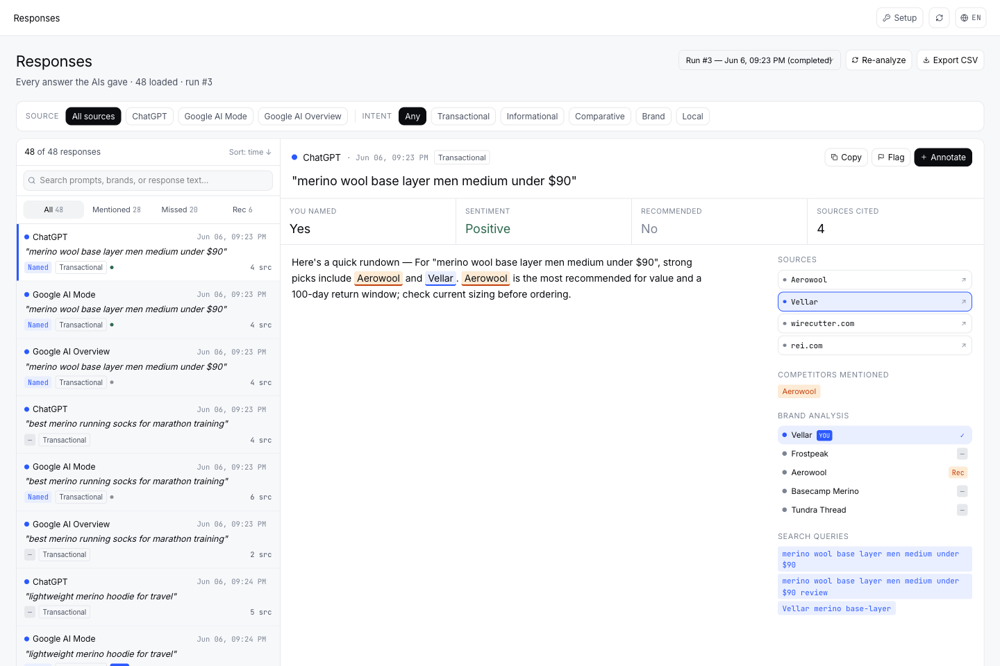
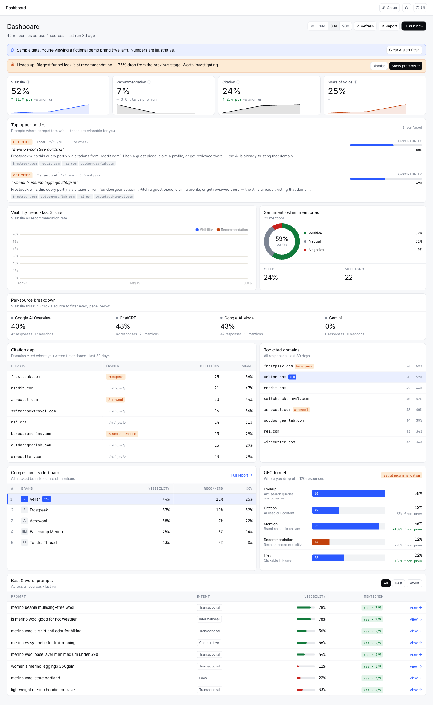
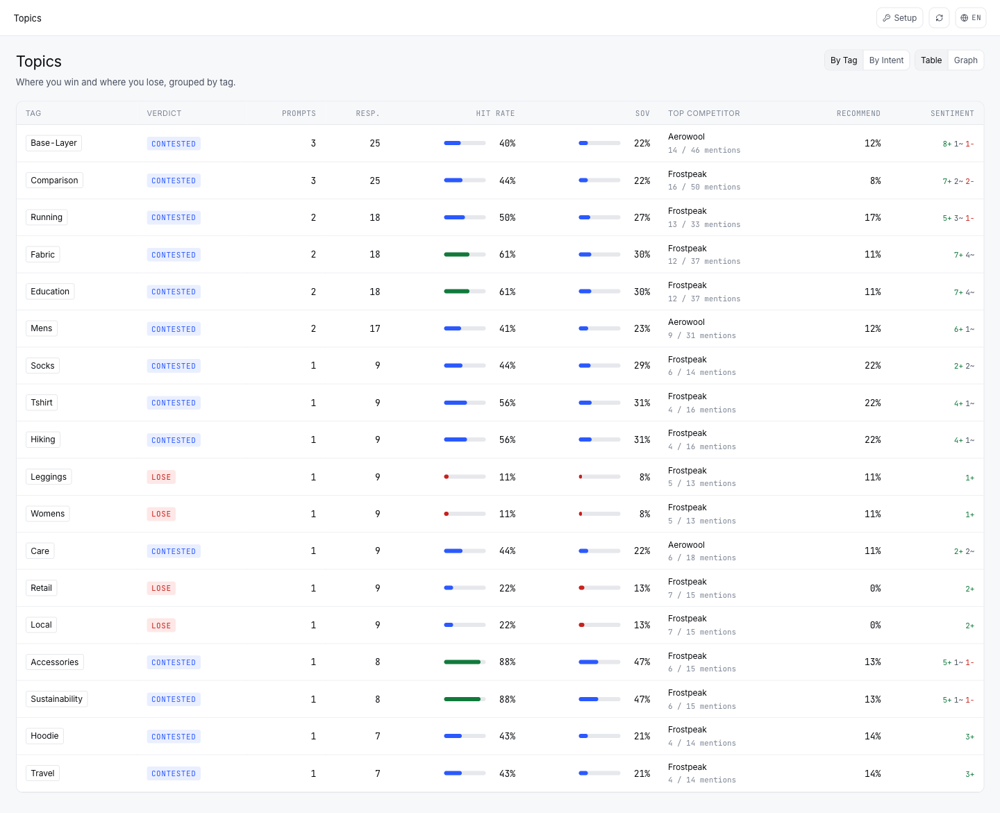
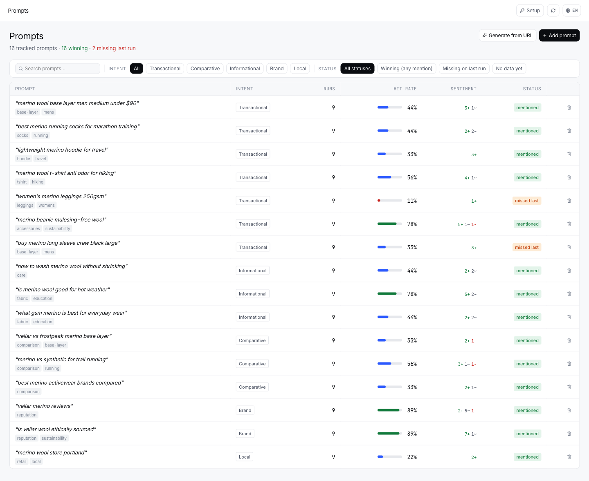

# AI Visibility Audit

**See if AI recommends your store — or your competitor's.** An open-source
audit of how your brand and products show up when shoppers ask ChatGPT,
Gemini, Google AI Mode & Google AI Overview "best X for Y" or "where to buy Z".

Built for ecommerce — works for any brand (SaaS, local, B2B).

## Why this matters

Shoppers increasingly ask AI assistants what to buy — and buy what gets
recommended. AI referral traffic to online stores is growing triple-digits
year over year. But when someone asks ChatGPT "best running shoes for flat
feet" or "where to buy an espresso machine under $500", you can't see whether
your store is recommended, ignored, or losing to a competitor.

This tool shows you — across every major AI assistant, for every buyer query
that matters in your category.

**Audit report** — a client-ready PDF you can hand to a stakeholder: KPIs,
competitor share, the queries you're missing, and concrete recommendations.

<div align="center">
  
</div>

## What one audit reveals

- Which competitor AI recommends instead of you — and for which buyer queries
- The high-intent questions ("best…", "where to buy…") where your store is invisible
- Which domains AI cites as sources (and which of your pages, if any)
- Sentiment and how you're framed when your brand *is* mentioned
- A prioritized list of what to fix first

## Screenshots

> Showing the built-in sample dataset — load it in one click, no API keys required.

**Responses** — every AI answer about your category: which store gets named, recommended, and cited.



**Dashboard** — visibility, the GEO funnel, competitor share, and the buyer queries where AI recommends someone else.



**Topics** — which product categories you win in AI answers, and which you're losing.



**Prompts** — the buyer queries being tracked, each with how often AI names your store and the trend over time.



## Quick start

```bash
git clone https://github.com/syntropicsignal-ai/ai-visibility-audit.git
cd ai-visibility-audit
docker compose up -d
```

Then open http://localhost:8080 — enter your API keys on first visit, or
load the sample dataset and explore with no keys at all. Migrations run
automatically on start.

## Works with any store

Point it at your store URL — Shopify, WooCommerce, PrestaShop, Magento,
BigCommerce, Medusa, Saleor, Vendure, or PL platforms like Shoper, IdoSell
& BaseLinker. The audit runs on any brand or domain, regardless of stack.

## What you need

- Docker Desktop (or Docker Engine + Compose v2)
- API keys: Gemini and Exa (prompt generation + analysis), DataForSEO
  (Google AI Overview + keyword signals). OpenAI is optional — it only
  powers the WildChat corpus stage of prompt generation.
- Bright Data — unlocks the ChatGPT, Gemini, and Google AI Mode sources,
  the main AI assistants this tool measures. Without it you'll track
  Google AI Overview only (via DataForSEO).

## Project layout

```
api/        FastAPI backend (Python, uv)
web/        Vue 3 frontend (TypeScript, Vite)
docker/     Container build files
```

## License

[AGPL-3.0](LICENSE).
